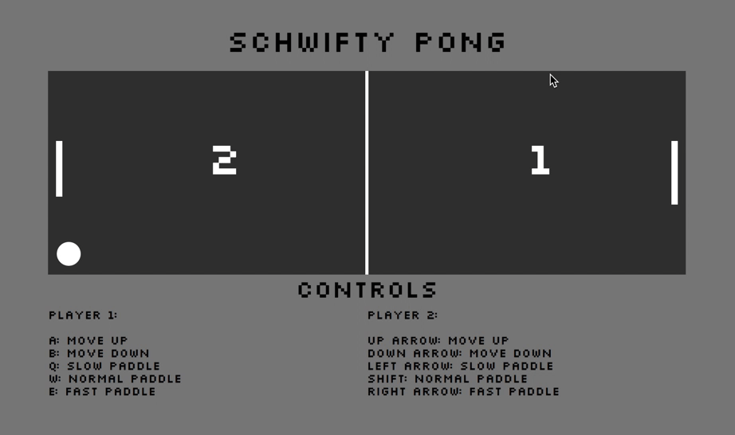

# Pong Game

A pong game build with Rick and Morty inspired sound effects. The game ends once a player gets to five points. An additional feature is that with each point scored, the scoring player will have a shortened paddle. The paddle speed can be changed. To restart the game once the game is over, press spacebar.

 
## Setup

**Install dependencies:**

`> npm i`

**Run locally with Webpack Dev Server:**

`> npm start`

**Build for production:**

`> npm run build`

## Keys

**Player 1:**
* a: up
* z: down
* q: slow paddle
* w: normal paddle
* e: fast paddle
**Player 2:**
* ▲ : up
* ▼: down
* left arrow: slow paddle
* shift: normal paddle
* right paddle: fast paddle
